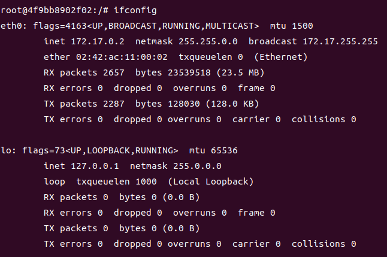

# 도커 이미지

- 컨테이너를 생성하는 파일
- 여러 개의 계층으로 된 바이너리 파일
- 이미지 이름 형태: [저장소]/[이미지]:[태그]

| **이름**   | **설명**                                            |
| ---------- | --------------------------------------------------- |
| **저장소** | 이미지가 저장된 장소, 생략시 기본 저장소(도커 허브) |
| **이미지** | 도커 이미지 파일 이름                               |
| **태그**   | 이미지의 버전, 생략시 최신 버전(latest)을 의미      |

# 도커 컨테이너

- 도커 이미지 파일로 생성한 컨테이너
- 독립적인 파일 시스템, 시스템 자원, 네트워크를 사용하는 공간

# 도커 명령어

## 도커 컨테이너 생성

- `docker run -i -t [저장소]/[이미지]:[태그]` : 컨테이너를 생성하고 실행하여 컨테이너 내부로 접속합니다.
- `docker create -i -t --name [컨테이너_이름] [저장소]/[이미지]:[태그]` : 컨테이너를 생성합니다.

  - `-i` : 상호 입출력
  - `-t` : 배시(bash) 셸 사용
  - `--name` : 컨테이너의 이름을 지정합니다.
  - `-it` : Attached 모드
  - `-d` : Detached 모드
  - `-e` : 컨테이너 내부 환경 변수
  - `--link [컨테이너_이름]:[별명]` : 내부 IP 대신 컨테이너의 별명(alias)으로 접속할 수 있도록 설정합니다. (Deprecated)

- `docker start` : 컨테이너를 실행합니다.
- `docker attach` : 컨테이너 내부로 접속합니다.
- `exit` or `Ctrl + D` : 컨테이너를 정지시키고 빠져나옵니다.
- `Ctrl + P, Q` : 컨테이너를 정지시키지 않고 빠져나옵니다.

## 도커 컨테이너 삭제

- `docker rm [컨테이너_이름]` : `종료(Exited)`된 컨테이너를 삭제합니다.
  - `-f` : `실행(Up)`중 인 컨테이너를 강제로 삭제합니다.
- `docker stop [컨테이너_이름]` : 컨테이너를 `종료(Exited)`합니다.
- `docker container prune` : `종료(Exited)`된 모든 컨테이너를 삭제합니다.

```
// 모든 컨테이너를 정지시키고 삭제합니다.
# docker stop $(docker ps -a -q)
# docker rm $(docker ps -a -q)
```

## 호스트 포트와 컨테이너 포트 바인딩



- `eth0` : 도커 NAT IP 주소
- `lo` : 로컬 호스트 주소

```
// 호스트 포트와 컨테이너 포트를 바인딩하면서 컨테이너 생성/실행/접속합니다.
# docker run -i -t --name [컨테이너_이름] -p [호스트_포트]:[컨테이너_포트] [저장소]/[이미지]:[태그]

// or

# docker run -i -t --name [컨테이너_이름] -p [호스트_포트]:[컨테이너_포트] -p [호스트_IP:포트]:[컨테이너_포트] [저장소]/[이미지]:[태그]

// or

# docker run -i -t --name [컨테이너_이름] -p [컨테이너_포트] [저장소]/[이미지]:[태그]

```

## Detached 모드 컨테이너 접속

- `detached 모드` : 컨테이너 내부 프로그램을 포그라운드로 실행합니다.
- `docker exec -i -t [컨테이너_이름] [실행할_프로그램]` : 컨테이너 내부에서 프로그램을 실행합니다.
  - `/bin/bash` : bash 셸을 실행합니다.
  - `ls /` : 루트 디렉터리의 목록을 출력합니다.
  - `exit`: `exec`으로 접속하면 컨테이너가 종료 되지 않습니다.

## 그외 명령어

- `docker pull` : 도커 이미지를 내려받습니다.
- `docker images` : 도커 이미지 목록을 출력합니다.
- `docker ps -a` : 생성한 컨테이너의 목록을 출력합니다.
  - `-a` : 생략시, 중지된 컨테이너는 제외됩니다.
  - `--format "table {{.ID}}\t{{.Status}}\t{{.Image}}` : 원하는 정보만 출력합니다.
- `docker inspect [컨테이너_이름] | grep Id` : 컨테이너의 ID를 확인합니다.
- `docker rename [컨테이너_이름] [새로운_컨테이너_이름]` : 컨테이너 이름을 변경합니다.
- `docker port [컨테이너_이름]` : 호스트와 바인딩된 포트를 확입합니다.
