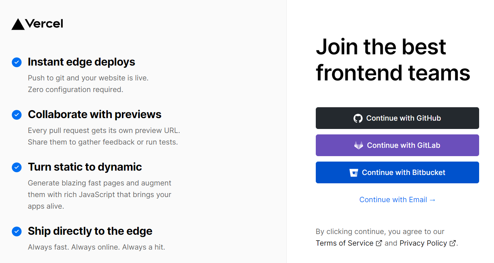
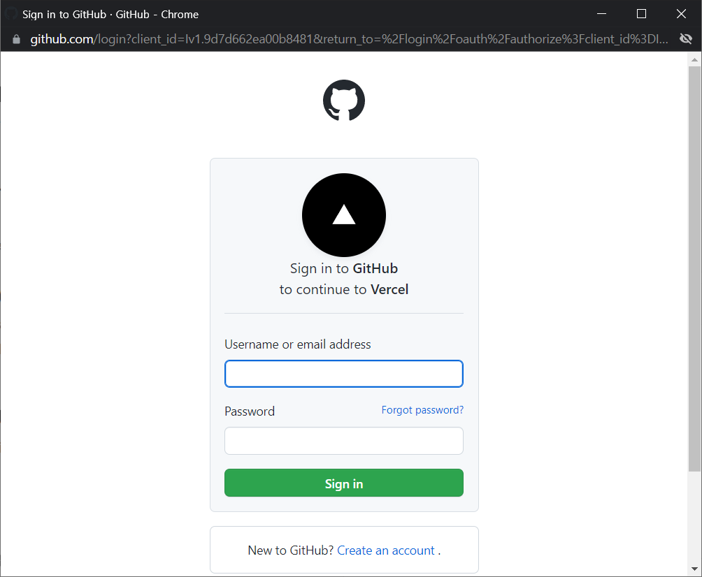
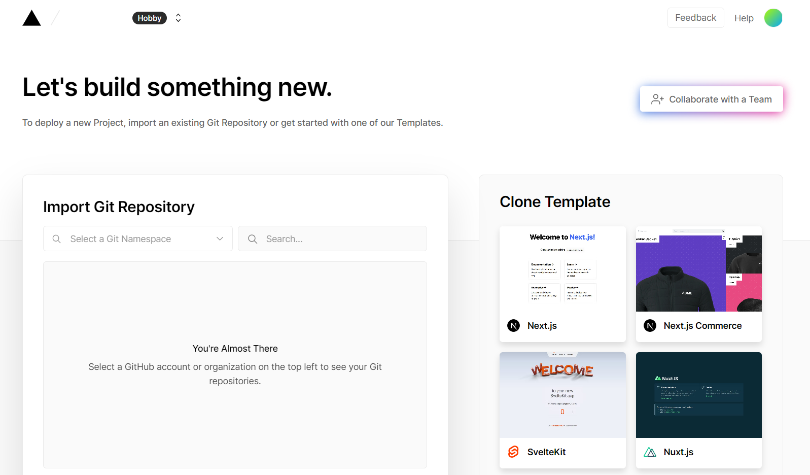
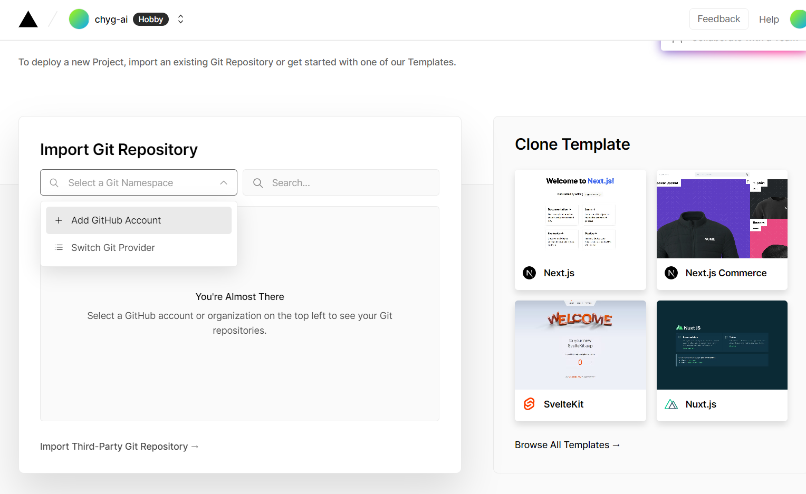
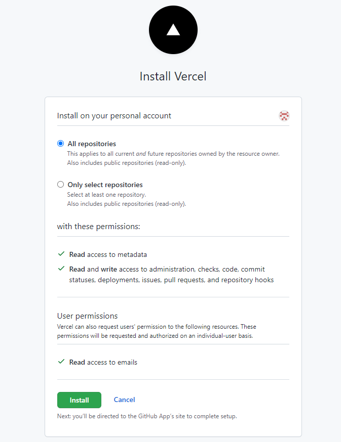
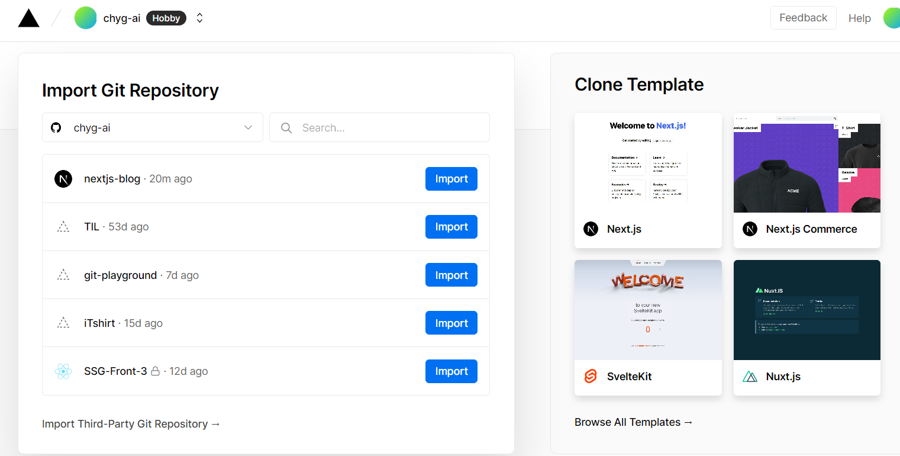
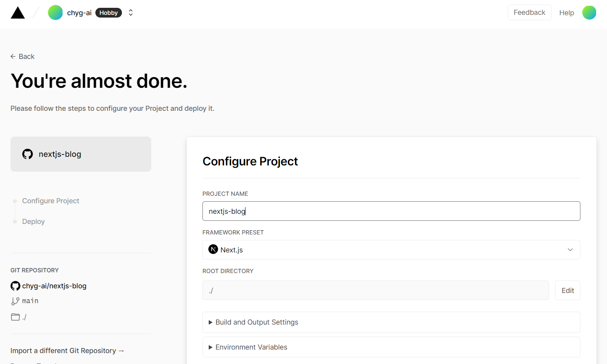
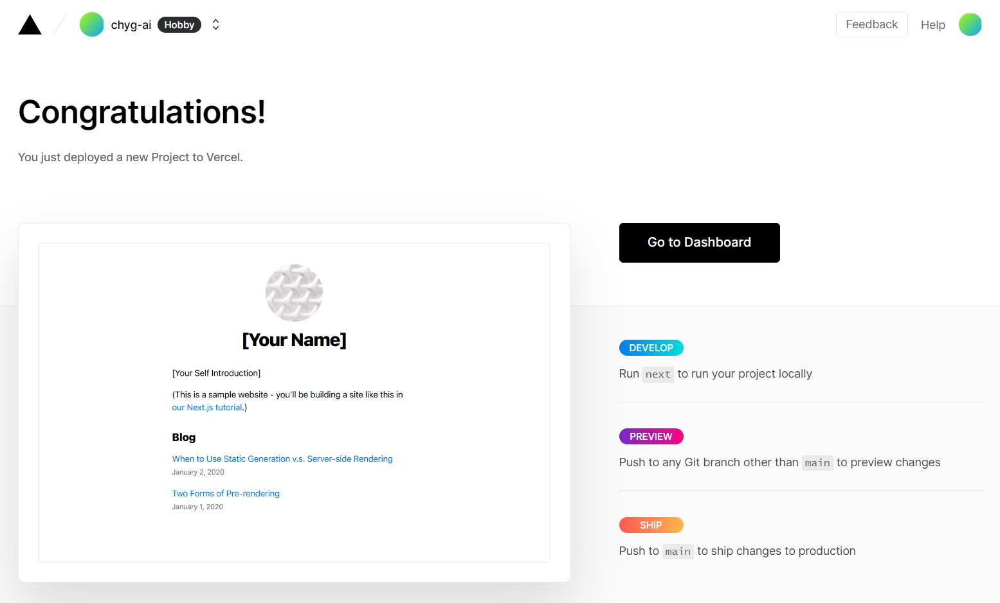
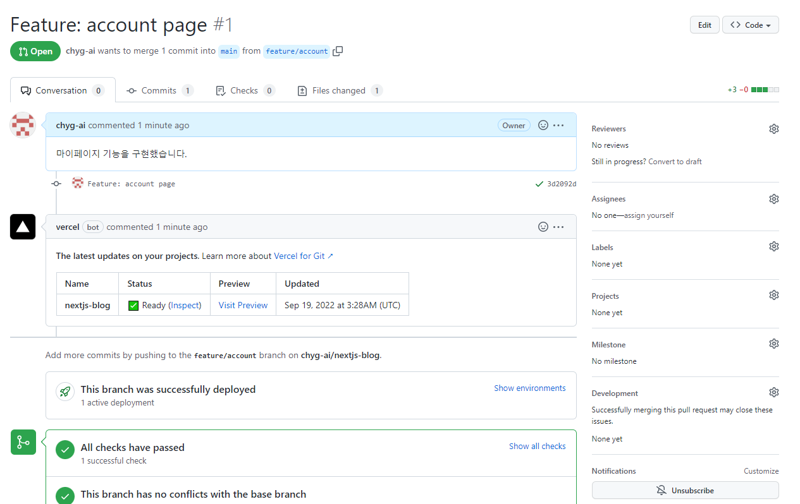

# Deploying Your Next.js App

# 배울 내용

- Next.js 애플리케이션을 프러덕션 환경에 배포하는 방법: [Vercel](https://vercel.com/)
- 배포 옵션 설정하는 방법
- DPS Workflow: Develop, Preview, Ship
- 호스팅 제공자에 Next.js 애플리케이션 배포 방법

# Push to Github

- 자신의 Github 계정에서 nextjs-blog 레포지토리를 생성합니다.
- 이 레포지토리는 공개(public) 또는 비공개(private)입니다.
- 레포지토리 생성에 관해서 자세한 내용은 [GitHub Guide](https://docs.github.com/en/get-started/quickstart/create-a-repo)를 참고하세요.
- `nextjs-blog` 디렉토리로 이동해서 `git init` 명령어를 실행합니다. `git init` 명령어는 로컬 저장소를 생성합니다.
- 로컬 저장소에게 원격 저장소를 알려주기 위해서 `git remote add [remote_name] [remote_url]` 명령어를 실행합니다.
- 로컬 저장소의 내용을 원격 저장소에 `Push` 합니다.

```
# cd nextjs-blog
# git init
# git commit -m "Deploying Your Next.js App"
# git remote add origin https://github.com/chyg-ai/nextjs-blog.git
# git branch -M main
# git push -u origin main
```

# Deploy to Vercel

- `Next.js` 애플리케이션을 프로덕션 환경에 배포하는 가장 쉬운 방법은 `Vercel` 플랫폼을 사용하는 것입니다.
- `Vercel`은 `Serverless` 플랫폼입니다.

## Create a Vercel Account

- [Vercel](https://vercel.com/signup) 계정을 생성합니다. 저는 Github 계정으로 생성했습니다.





## Import your nextjs-blog repository

- 계정이 생성됐으면 Vercel에서 nextjs-blog 레포지토리를 import 합니다.





- 다음 옵션 세팅은 기본 값을 사용하면 됩니다.
- Vercel은 Next.js App을 자동으로 감지해서 최적의 빌드 세팅 값을 선택합니다.
- `Deploy` 버튼을 클릭하세요.



- Deploy가 완료됐습니다!
- `Go To Dashboard` 버튼을 클릭하면 `Deployment URL`을 확인할 수 있습니다.
- `Domain` 주소를 통해서 Next.js 애플리케이션에 접속할 수 있습니다!



# Next.js and Vercel

- Vercel은 Next.js 개발팀에서 만들어졌습니다.
- Next.js 애플리케이션을 Vercel에 배포하면 다음과 같은 일들이 발생합니다.
  - `Static Generation`과 `assets(JS, CSS, 이미지, 폰트 등)`을 사용하는 페이지들은 자동으로 [Vercel Edge Network](https://vercel.com/docs/concepts/edge-network/overview)에서 제공됩니다.
  - `Server-Side Rendering`과 `API Routes`를 사용하는 페이지들은 자동으로 독립적인 `Serverless` 함수들로 변환됩니다.
- 그 외에도 다양한 기능들을 제공합니다.
  - `커스텀 도메인(Custom Domains)`: Vercel에 한 번 배포하면, Next.js 애플리케이션에 도메인이 부여됩니다.
  - `환경 변수(Environment Variables)`: Vercel에서 환경 변수를 설정할 수 있습니다.
  - `HTTPS`: 추가적인 설정 없이 기본적으로 HTTPS가 활성화됩니다.
- Vercel 플랫폼에 대한 자세한 내용은 [Vercel Documentation](https://vercel.com/docs)을 참고해주세요.

# Preview Deployment for Every Push

- Vercel에 애플리케이션을 배포한 뒤 다음과 같은 상황이 발생합니다.
  - Next.js 애플리케이션에서 새로운 브랜치를 생성합니다.
  - 소스코드를 수정하고 원격 레포지토리에 Push 합니다.
  - 새로운 Pull Request를 생성합니다.
- `Create Pull Request`를 클릭하면 아래 이미지와 같이 `Preview URL`을 확인할 수 있습니다.
- `Preview URL`을 클릭하면 변경된 내용을 확인할 수 있습니다.
- 저는 `account` 페이지를 생성하고 배포된 `Next.js` 애플리케이션에서 `/account`로 접속해서 페이지를 확인할 수 있었습니다.
- `Merge pull request`를 클릭하면 프로덕션 환경에서 변경된 내용이 반영됩니다.



# Develop, Preview, Ship

- `Develop` : Next.js 애플리케이션을 개발합니다.
- `Preview` : 브랜치를 생성해서 변경된 내용을 브랜치에 반영합니다. 앞서 새로운 Pull Request를 생성하면 Preview Deployment에서 변경된 내용을 확인할 수 있습니다.
- `Ship` : Pull Request가 합병되면 프로덕션 환경에 반영됩니다.

# Other Hosting Options

- Next.js는 어떤 호스팅 제공자에게도 배포될 수 있습니다.
- package.json 파일에 `build`와 `start` 스크립트를 포함해야 합니다.

```
// .next 디렉터리에 프로덕션 환경의 애플리케이션이 빌드됩니다.
$ npm run build

// Node.js 서버를 실행시키고 Static Generation, Server-side Rendering, API Routes를 제공합니다.
$ npm run start
```

- `package.json` 파일의 `start` 스크립트에서 `port` 번호를 임의로 지정할 수 있습니다.

```
{
  "scripts": {
    "dev": "next",
    "build": "next build",
    "start": "next start -p $PORT"
  }
}
```

# Reference

- [Next.js Deploying Your Next.js App](https://nextjs.org/learn/basics/deploying-nextjs-app)
- [What is serverless?](https://www.redhat.com/en/topics/cloud-native-apps/what-is-serverless)
