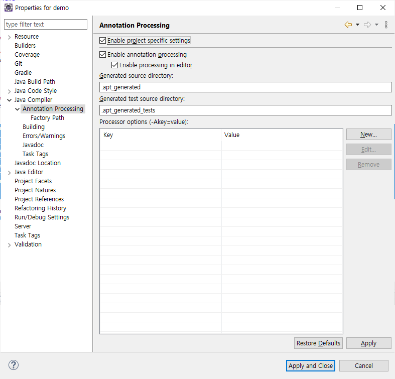
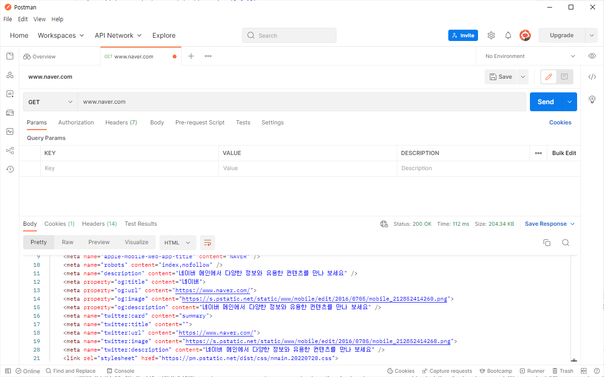

# 백엔드 개발

**백엔드 개발 도구**

- 스프링 부트(Springboot)
- 그래들(Gradle)
- 롬복(Lombok)
- 포스트맨(Postman)
- REST
- 레이어드 아키텍처(Layered Architecture)

**스프링 프레임워크**

- 제어의 역전(Inversion of Control, IoC)
- 의존성 주입(Dependency Injection, DI)
- 스프링 AOP(Aspect Oriented Programming)
- 스프링 ORM(Object Relational Mapping)

## 의존성 주입

- Constructor
- Setter

```
// constructor
public class Service{
    private final Interface if;

    // 생성자의 매개변수 : Interface의 구현체
    public Service(Interface if){
        this.if = if;
    }
}
```

```
// Setter
public class Service{
    private final Interface if;

    // 세터 함수의 매개변수: Interface의 구현체
    public void setImp(Interface if){
        this.if = if;
    }
}
```

## 스프링 부트

- 스프링 기반 애플리케이션을 쉽게 구동
- 스탠드 얼론 애플리케이션
- 자동 설정

**Before**

자바 애플리케이션 → WAR 파일 → 톰캣배포

**After**

자바 애플리케이션 → 실행

## 서블릿 클래스

```
public class ServletExample extends HttpServlet {
    @Override
    public void doGet(HttpServletRequest req, HttpServletResponse res) {
        // business logic
    }
}
```

- HttpServlet
- HttpServletRequest
- HttpServletResponse

## 스프링 부트 컨트롤러

- DispatcherServlet

```
@RestController
public class HelloController {
    @GetMapping("/test")
    public String process(@RequestParam String name){
        // business logic
    }
}
```

- @RestController
- @GetMapping
- @RequestParam

## 스프링 부트 메인 클래스

```
@SpringBootApplication
public class DemoApplication {

	public static void main(String[] args) {
		SpringApplication.run(DemoApplication.class, args);
	}
}
```

- @SpringBootApplication : 스프링 부트 설정 클래스(베이스 패키지)

## 스프링 부트 의존성 주입

- @ComponentScan

```
// @SpringBootApplication 내부
// ...
@ComponentScan
public @interface SpringBootApplication {
    //...
}
```

- @Component(= @Controller, @Service, @Repository)
- @Autowired

```
// @Component

@Service
public class ServiceImpl implement Service{ ... }
```

```
// @Autowired

@RestController
public class MainController {
    @Autowired
    private Service svc; // ServiceImpl 구현체가 생성되어 할당된다.
}
```

- @Configuration
- @Bean

```
@Configuration
public class ConfigClass{
    @Bean
    public Controller getController(){
        if(env == 'local'){
            return new LocalController(...);
        }
        return new Controller(...);
    }
}
```

## Gradle

- 빌드 자동화 툴
- 컴파일
- 라이브러리 다운로드
- 패키징(jar 파일)
- 빌드
- 테스팅(유닛 테스트)

```
// build.Gradle

plugins {
	id 'org.springframework.boot' version '2.6.10'
	id 'io.spring.dependency-management' version '1.0.12.RELEASE'
	id 'java'
}

group = 'com.example' // 프로젝트 식별자
version = '0.0.1-SNAPSHOT' // 프로젝트 버전
sourceCompatibility = '11' // 자바 소스코드 컴파일 버전

configurations {
	compileOnly {
		extendsFrom annotationProcessor // 롬복 어노테이션 프로세서
	}
}

repositories {
	mavenCentral() // 라이브러리 저장소
}

dependencies { // 프로젝트에서 사용할 라이브러리 명시
	implementation 'org.springframework.boot:spring-boot-starter-data-jpa'
	implementation 'org.springframework.boot:spring-boot-starter-web'
	compileOnly 'org.projectlombok:lombok'  // 롬복(lombok) 라이브러리 추가
	runtimeOnly 'com.h2database:h2'
	annotationProcessor 'org.projectlombok:lombok'
	testImplementation 'org.springframework.boot:spring-boot-starter-test'
}

tasks.named('test') {
	useJUnitPlatform() // JUnitPlatform
}
```

## Lombok

- getter, setter, builder, constructor 코드 자동 생성

```
//...
dependencies {
    ...
    // lombok dependency
	compileOnly 'org.projectlombok:lombok'
	annotationProcessor 'org.projectlombok:lombok'
    ...
}
```

**이클립스를 사용하는 경우**

프로젝트 우클릭 → Properties → Java Compiler → Annotation Processing → Apply and Close



```
// lombok test
package com.example.demo;

import lombok.Builder;
import lombok.NonNull;
import lombok.RequiredArgsConstructor;

@Builder
@RequiredArgsConstructor
public class DemoModel {
	@NonNull
	private String id;
}
```

## Postman

- REST API 테스트 툴
- API 스모크 테스팅(Smoke Testing)



# Reference

- [What is "group" property for in Gradle?](https://stackoverflow.com/questions/23354243/what-is-group-property-for-in-gradle)
