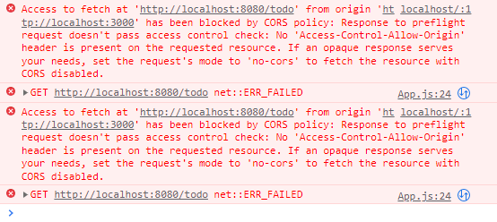
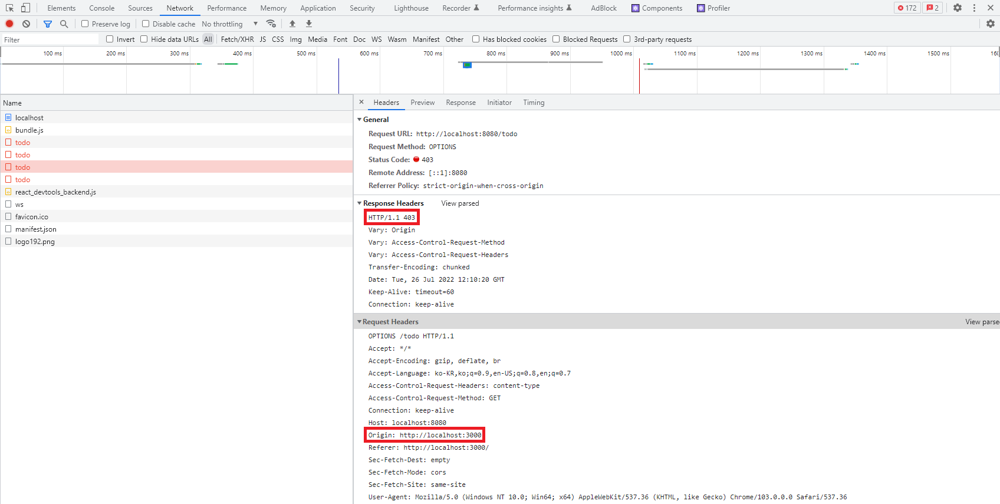
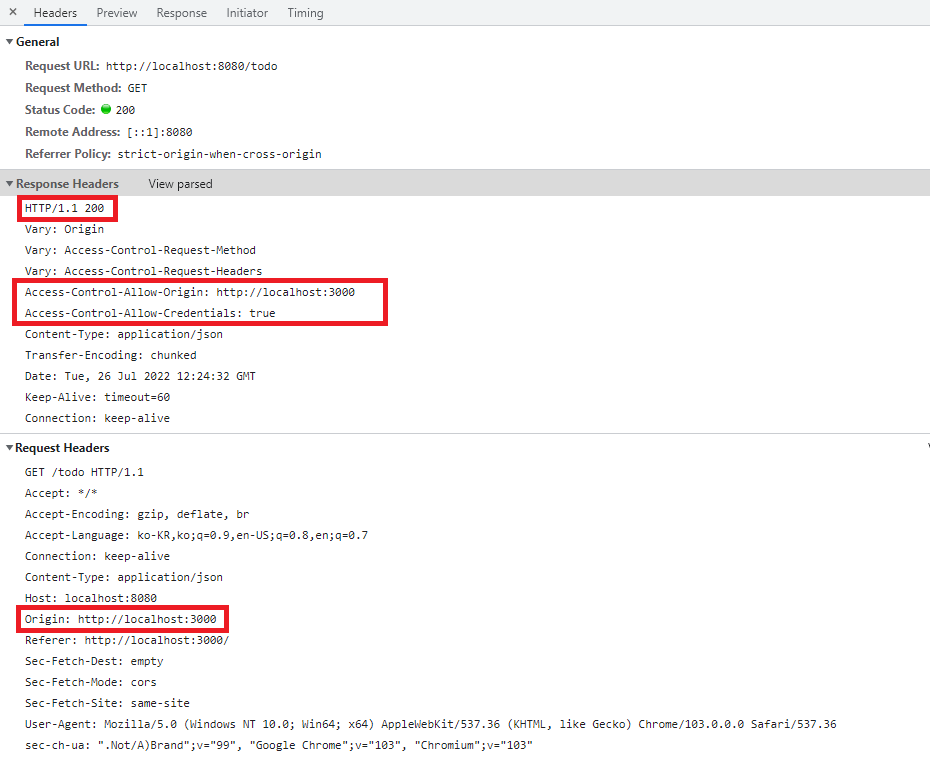

# 프론트 백엔드 통합 : CORS, Cross-Origin Resource Sharing

프론트 엔드 애플리케이션에서 백엔드 애플리케이션으로 REST API 요청을 보내면 다음과 같이 CORS 에러가 발생한다.



**HTTP Request/Response**



## CORS란?

- Cross-Origin Resource Sharing의 약자
- 서비스를 제공받은 도메인(nodejs)과 현재 서비스를 요청한 도메인(springboot)이 다를 경우 발생하는 에러
- 웹 브라우저는 "localhost:3000"으로 nodejs 서버로부터 리소스를 제공받고 리액트 앱에서 "localhost:8080"으로 리소스를 요청하기 때문에 에러가 발생한다.


## 백엔드 CORS 설정

```
@Configuration
public class WebMvcConfig implements WebMvcConfigurer {

	private final long MAX_AGE_SECS=3600;


	@Override
	public void addCorsMappings(CorsRegistry registry) {
		registry.addMapping("/**")
				.allowedOrigins("http://localhost:3000") // Origin : localhost:3000인 경우
				.allowedMethods("GET", "POST", "PUT", "PATCH", "DELETE", "OPTIONS") // HTTP 메서드 허용
				.allowedHeaders("*") // 헤더 및 인증 정보 모두 허용
				.allowCredentials(true)
				.maxAge(MAX_AGE_SECS);
	}
}
```

## 결과 확인



# Reference

- [[네트워크/HTTP] OPTIONS 메소드를 쓰는 이유와 CORS란?
  ](https://hanamon.kr/%EB%84%A4%ED%8A%B8%EC%9B%8C%ED%81%AC-http-options-%EB%A9%94%EC%86%8C%EB%93%9C%EB%A5%BC-%EC%93%B0%EB%8A%94-%EC%9D%B4%EC%9C%A0%EC%99%80-cors%EB%9E%80/)
